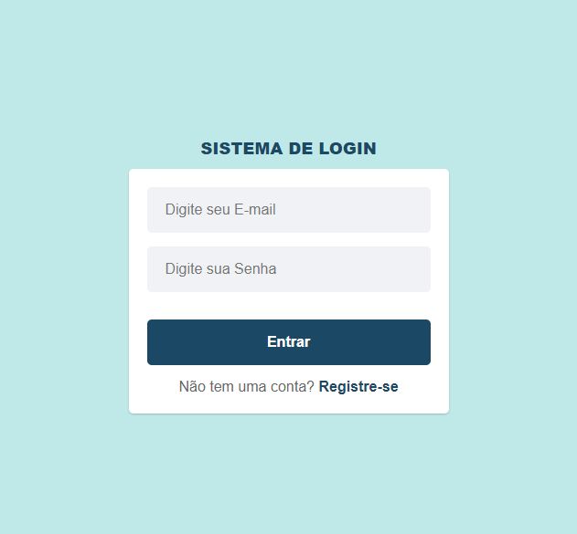
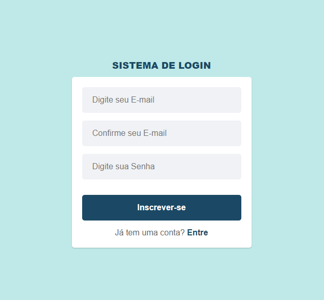

<h1 align="center"> Sistema de Login </h1>

## 💻 Sobre o projeto
Sistema de Login simples feito em ***ReactJs*** onde podemos logar e permanecer logados com o ***Context API***, sessão de cadastro verificando se o usuário já foi cadastrado e armazenando os dados no Local Storage do navegador.

## Autor

Feito por ***Rafael Morais***
 
👋🏽 Entre em contato!

